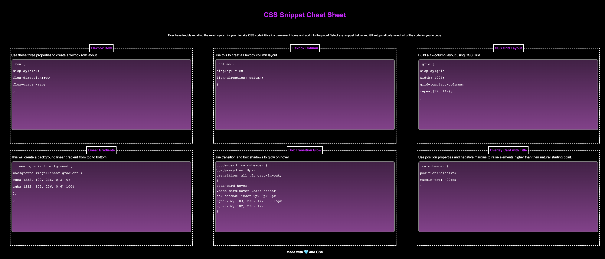

# mini-project-02
# Challenge #1 Accessibility Challenge

Version 1
Deployed 24 September 2023

## Description

Mini Project #2 focused on building a responsive web page that would house snippets of CSS code that could be used to enhance a webpage. The goal was to have six different cards, each with a title, a description, and the code itself. The code itself was to be on its own card-within-a-card and have a purple gradient background. When hovered-over, the cards would have a purple glow, as would their headers. Finally the page would be responsive, with a certain number of columns appearing at certain screen size breakpoints.

## Installation

N/A

## Challenges

This is the first page I have ever really built from scratch with both HTML and CSS. As a result, the prospect of beginning was overwhelming. Our instructor, Leah Nelson, reminded us to focus on one thing at a time. A simple instruction, but one I needed to hear. I started with the HTML, making sure I had labelled all of my divs and sections in a way that made sense, and getting a feel for the hierarchy of the page. Once everything was in place, it was a simple thing to start the CSS stylesheet based on the structure of my HTML.

There was a lot of trial and error around making the card grid responsive, as well as how to set the media queries correctly. At the initial deployment, I am still not sure they are correct. I will need to seek more information in Office Hours to make sure.

## Credits

Initial source code and assets were provided through the University of Texas at Austin Bootcamp, housed on Github through The Coding Bootcamp account in the urban-octo-telegram repository, https://github.com/coding-boot-camp/urban-octo-telegram.

Additional guidance was given by instructor Leah Nelson in office hours.

## License

Please refer to the license in the repo.

---
